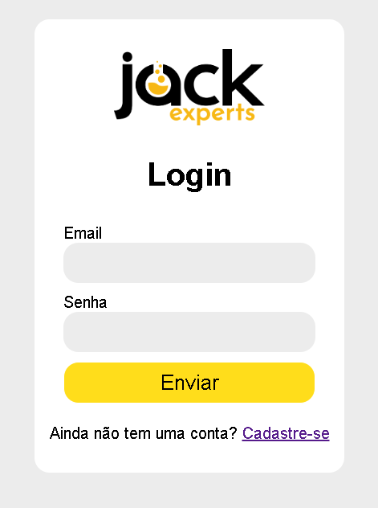
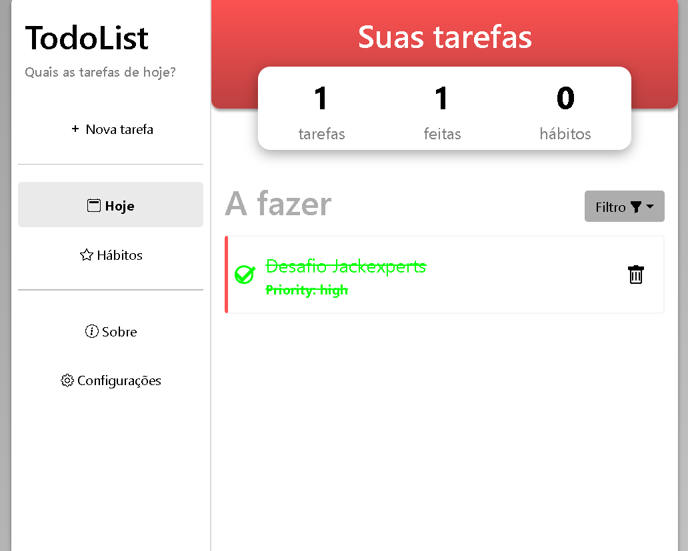

# Desafio jackexperts




## Como usar

## Instalação

1. **Clone o Repositório**

   ```bash
   git clone https://github.com/Alcantara-Diego/desafioTarefas


2. **Instale as Dependências**


Navegue até o diretório do backend e instale os pacotes necessários:

```bash
cd desafioTarefas
npm install
npm intall .env
````
3. Crie o arquivo .env e insira o valor:
 SECRET_TOKEN=

 Dentro dele gere um token e o insira por lá

 4: Abra o mysql em sua máquina, e crie o banco de dados desafio_tarefas

 5: Inicie o mysql e acesse o frontend hospedado no github:
[Visite o site do Projeto](https://alcantara-diego.github.io/desafioTarefasFront/#/)

O frontend está configurando para fazer requisições ao backend localhost, e poderá ser acessado após o servidor rodar


# Sobre o desafio

Primeira vez em que fiz um projeto envolvendo frontend, backend e banco de dados de uma vez, pude aprender muito em como os 3 pontos interagem entre si e como funciona as requisições e criptografia. Foi um bom aprendizado, mesmo que não tenha conseguido emplementar tudo que foi proposto

# Consegui:
-Usar as tecnologias propostas e integrar React com Node e Mysql.

-Fazer as operações de create e read do CRUD

-Criptografar as senhas para não serem expostas no banco de dados

-gerar token jwt

# Não consegui:
-Hospedar o backend na nuvem

-Preparar a todolist para interagir com o resto da aplicação e com o jwt

# final
[Visite o login para rodar com o backend aqui](https://alcantara-diego.github.io/desafioTarefasFront/#/)

A todolist foi criada há um tempo e não consegui integra-la com o backend, os dados dela são salvos no localstorage, mas pode [ser acessada por esse link](https://alcantara-diego.github.io/desafioTarefasFront/#/) (Apenas o sistema de login interage com o backend e resto da aplicação. Por isso, a todolist funciona mesmo sem ter o backend rodando)